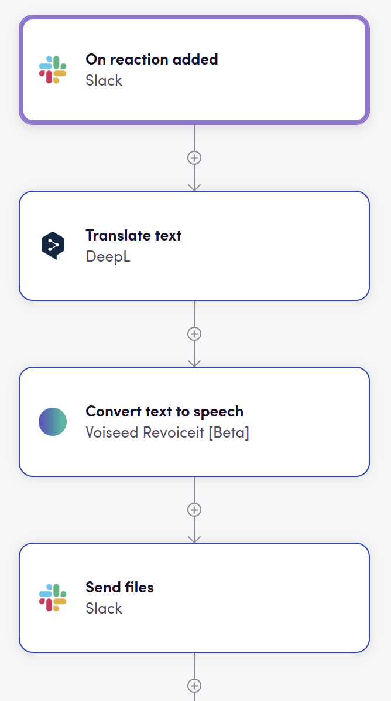

# Blackbird.io Voiseed

Blackbird is the new automation backbone for the language technology industry. Blackbird provides enterprise-scale automation and orchestration with a simple no-code/low-code platform. Blackbird enables ambitious organizations to identify, vet and automate as many processes as possible. Not just localization workflows, but any business and IT process. This repository represents an application that is deployable on Blackbird and usable inside the workflow editor.

## Introduction

<!-- begin docs -->

[Voiseed`s](https://docs.revoiceit.com/docs/api/Authentication/), start by creating your API key:

- Go in the upper left corner of application and click on menu.
- Select "API" from the dropdown menu.
- In Key managment section, click on "Create API Key" button.
- Enter a name for your API key and click on "Create" button.

## Actions

### Speech

- **Convert text to speech** Convert provided text to a speech with selected settings
- **Get convert text to speech status** Get convert text to speech status
- **Download TTS audio** Download converted text to speech audio files

### Project

- **Create project** Create a new project
- **Get project** Get project details
- **Search projects** Searches projects

### Batch

- **Create batch** Create a new batch
- **Get batch** Get batch details

## Example

## Feedback

Do you want to use this app or do you have feedback on our implementation? Reach out to us using the [established channels](https://www.blackbird.io/) or create an issue.

<!-- end docs -->
